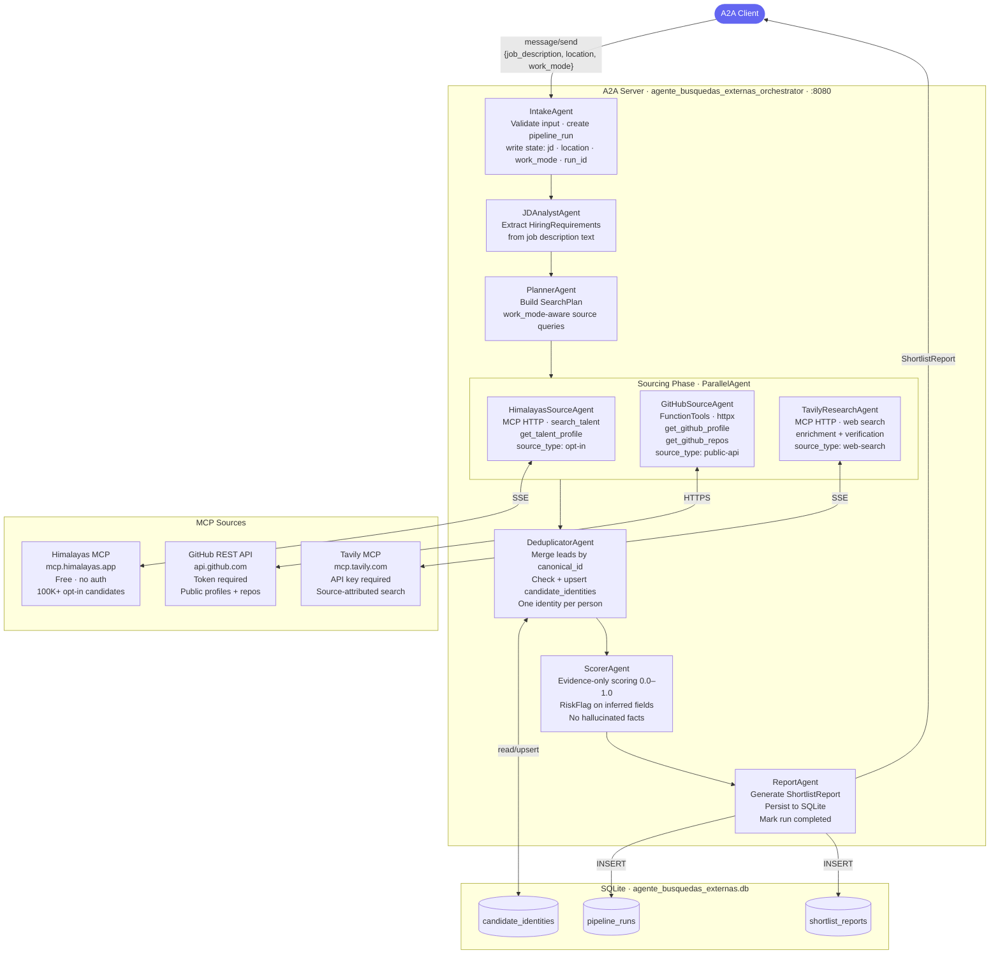

# agente_busquedas_externas

Multi-agent recruiting and candidate-sourcing system built with Google ADK, A2A protocol, and MCP integrations.

Receives a job description, location, and work mode over A2A. Returns a sourced, scored, evidence-attributed candidate shortlist.

---

## Architecture



---

## Protocol Boundaries

| Layer | Technology | Responsibility |
|-------|-----------|----------------|
| External interface | A2A v0.3 | Receive JD + location + work_mode; return ShortlistReport |
| Internal orchestration | Google ADK | SequentialAgent pipeline; shared `session.state` blackboard |
| Source adapters | MCP (HTTP SSE) | Himalayas, Tavily — remote MCP servers, no local process |
| Technical signal | ADK FunctionTools | GitHub REST API via httpx — no Docker, no MCP subprocess |
| Persistence | SQLite → Supabase | Audit trail + cross-run candidate deduplication |

---

## Agent Pipeline

```
IntakeAgent          → validates A2A input, creates pipeline_run in DB
JDAnalystAgent       → extracts HiringRequirements from JD text
PlannerAgent         → builds SearchPlan (work_mode + location aware)
─── ParallelAgent ───────────────────────────────────────────────────
  HimalayasSourceAgent  → opt-in candidate profiles (remote-first)
  GitHubSourceAgent     → technical signal from public repos
  TavilyResearchAgent   → web enrichment + claim verification
─────────────────────────────────────────────────────────────────────
DeduplicatorAgent    → merges leads by GitHub username / email
ScorerAgent          → evidence-only scoring + risk flags
ReportAgent          → ShortlistReport → persisted to SQLite → A2A response
```

---

## Domain Model

```
JobDescription ──→ HiringRequirements ──→ SearchPlan
                                              │
                           ┌──────────────────┤
                           ▼                  ▼
                     CandidateLead     CandidateLead
                     (himalayas)       (github/tavily)
                           │
                    CandidateEvidence
                    {source_url, source_type,
                     verified, inferred}
                           │
                    CandidateIdentity  (deduped)
                           │
                    CandidateScore
                    {score 0–1, reasoning, risk_flags}
                           │
                    ShortlistReport
```

---

## Running

```bash
# Install
pip install -e ".[dev]"

# Configure (copy and fill in your keys)
# DB_PATH=./agente_busquedas_externas.db
# GITHUB_TOKEN=ghp_...
# TAVILY_API_KEY=tvly-...
# GOOGLE_API_KEY=...

# Start the A2A server
python -m src.main

# Send a test request (separate terminal)
python send_task.py
```

---

## Data Trust Model

| Source | Type | Verified | Notes |
|--------|------|----------|-------|
| Himalayas | `opt-in` | ✅ | Candidates self-listed as available |
| GitHub | `public-api` | ✅ | Official API, no scraping |
| Tavily | `web-search` | ❌ | Source-attributed, not verified |

Every `CandidateEvidence` carries `source_url`, `source_type`, `verified`, and `inferred` flags.
The scorer only uses evidence — it never generates or infers facts.

---

## Stack

- **[Google ADK](https://adk.dev)** — multi-agent orchestration
- **[A2A Protocol](https://a2a-protocol.org)** — agent interoperability (Linux Foundation)
- **[Himalayas MCP](https://himalayas.app/mcp)** — candidate sourcing
- **[Tavily MCP](https://docs.tavily.com/documentation/mcp)** — web research
- **[GitHub REST API](https://docs.github.com/en/rest)** — technical signal
- **SQLite** (dev) / **Supabase** (prod) — persistence
